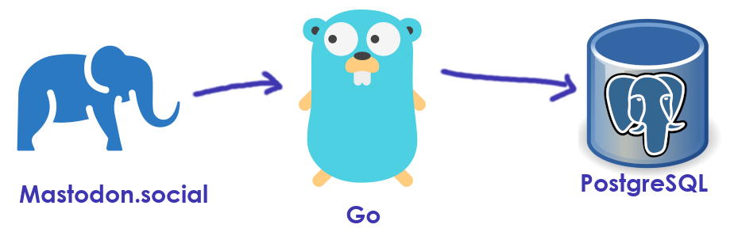

# Mastodon Statuses to Postgres (Go)


A Go script that retrieves your posts from a Mastodon user and stores them in PostgreSQL.




---

🔥 Cool Features
* Fetch Mastodon posts and store them in PostgreSQL
* Supports media attachments
--- 

🚀 Installation

**Initial setup**<br>
1. **Install Go:** https://golang.org/doc/install
2. **Clone repository:** the repository and navigate to the project folder.
3. **Install dependencies:** Run `go mod tidy` to install dependencies.

**Setup PostgreSQL**<br>
* Create a database `msg-dev`.
* Username: `postgres`
* Password: `root`

Add the connection strings for PostgreSQL to your **environment variables**.
In Goland editor this is done by
Edit Configurations > Run/Debug Configurations + Go Build<br>
Files: `main.go`<br>
Environment: `DB_HOST=localhost;DB_NAME=msg-dev;DB_PASSWORD=root;DB_PORT=5432;DB_USER=postgres;MASTODON_USERNAME=ekeberg`<br>

**Setup Mastedon Account**<br>
* **Create account:** Go to https://mastodon.social and create a new account. <br>
* **Write some posts:** You can add images to the posts also
* **Username** The Mastedon `username` is read by environment variable `MASTODON_USERNAME`.


**Running Locally**<br>
* **Run locally:** `go run main.go`.


**Running Locally with Docker**<br>
* **Build:** `docker build -t mastodon-statuses-to-postgres-go .`.
* **Run:** `docker run -p 8080:8080 mastodon-statuses-to-postgres-go`


---

## 📖 License

This project is licensed under the
[Apache License 2.0](https://www.apache.org/licenses/LICENSE-2.0).

```
Copyright 2024 github.com/ditlef9

Licensed under the Apache License, Version 2.0 (the "License");
you may not use this file except in compliance with the License.
You may obtain a copy of the License at

    http://www.apache.org/licenses/LICENSE-2.0

Unless required by applicable law or agreed to in writing, software
distributed under the License is distributed on an "AS IS" BASIS,
WITHOUT WARRANTIES OR CONDITIONS OF ANY KIND, either express or implied.
See the License for the specific language governing permissions and
limitations under the License.
```